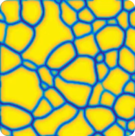

| | | | | |
:-------------------------:|:-------------------------:|:-------------------------:|:-------------------------:|:-------------------------:
 |  |  |  | 

### Hi there 👋 I'm Jakub.

I'm a researcher at IHPC, A\*STAR, Singapore and I am passionate about modelling and simulation of deformation and failure of materials from perspective of solid mechanics and additive manufacturing.  

<!--  
-->

 

<!--
<table style="border-collapse: collapse; border: none;">
  <tr>
  <td>
      
  </td>
  </tr>
  <tr>
  <td>
      
  </td>
  </tr>
</table>
-->

<!--
**MikulaJakub/MikulaJakub** is a ✨ _special_ ✨ repository because its `README.md` (this file) appears on your GitHub profile.

Here are some ideas to get you started:

- 🔭 I’m currently working on ...
- 🌱 I’m currently learning ...
- 👯 I’m looking to collaborate on ...
- 🤔 I’m looking for help with ...
- 💬 Ask me about ...
- 📫 How to reach me: ...
- 😄 Pronouns: ...
- ⚡ Fun fact: ...
-->

Find me elsewhere 🌏

